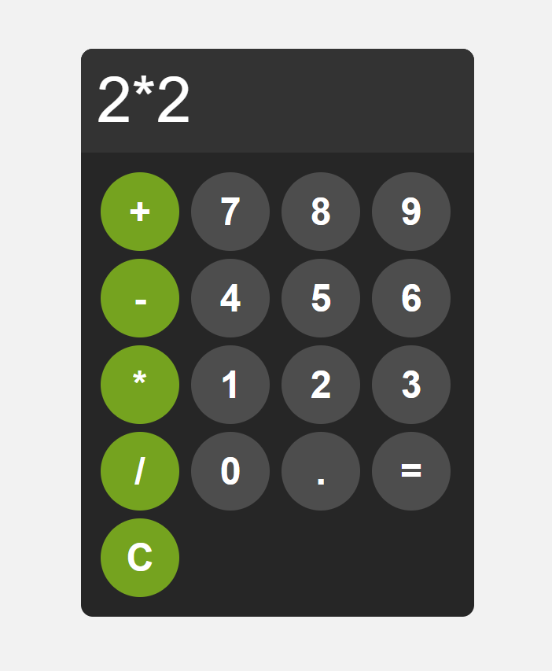

# 🧮 JavaScript Calculator

Basit bir hesap makinesi uygulaması.  
Toplama, çıkarma, çarpma ve bölme işlemleri yapabilmektedir.  

## 🚀 Çalıştırma
1. Repo’yu indirin  
2. `index.html` dosyasını tarayıcıda açın  

## 📸 Görsel

